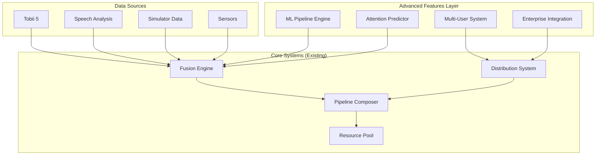

# Advanced Features Development Plan
**Comprehensive Architecture & Implementation Strategy**

## 🎯 Executive Summary

Building on our solid architectural foundation, this plan outlines the development of advanced features that leverage resource sharing, maximize efficiency, and ensure future-proofing. The approach emphasizes **extending existing systems** rather than creating parallel architectures, following the proven factory-function paradigm.

---

## 🏗️ Architecture Strategy

### **Core Design Principles**

1. **Extend, Don't Replace**: Build on existing cognitive, distribution, and pipeline systems
2. **Resource Efficiency**: Leverage shared memory pools, caches, and connection management
3. **Functional Paradigm**: Factory functions + immutable configurations + event-driven communication
4. **Zero Dependencies**: Maintain Bun-native implementation for maximum performance
5. **Type Safety**: Full TypeScript integration with strict typing
6. **Resilience**: Circuit breaker patterns with graceful degradation

### **Integration Architecture**



---

## 🚀 Advanced Feature Specifications

### **1. Machine Learning Pipeline Engine**

**Objective**: Implement adaptive learning algorithms that improve cognitive state prediction accuracy over time.

#### **Architecture Design**

```typescript
// Factory pattern integration
export const createMLPipelineEngine = (config = {}) => {
  const {
    modelTypes = ['attention-prediction', 'workload-estimation', 'fatigue-detection'],
    trainingMode = 'online',
    performanceThreshold = 0.85,
    resourcePool = config.resourcePool
  } = config;

  const state = {
    models: new Map(),
    trainingData: new CircularBuffer(config.bufferSize || 10000),
    predictions: new Map(),
    performance: new Map()
  };

  return {
    // Core ML operations
    trainModel: async (modelType, data, labels) => { /* implementation */ },
    predict: async (modelType, features) => { /* implementation */ },
    evaluateModel: (modelType, testData) => { /* implementation */ },
    
    // Integration with existing systems
    integrateWithFusion: (fusionEngine) => { /* implementation */ },
    subscribeToDataStreams: (distributionManager) => { /* implementation */ },
    
    // Resource management
    optimizeMemoryUsage: () => { /* implementation */ },
    cleanup: () => { /* implementation */ }
  };
};
```

#### **Resource Sharing Strategy**

- **Memory Pool Integration**: Reuse existing tensor buffers and typed arrays
- **Compute Resource Sharing**: Leverage WebGL contexts for GPU-accelerated training
- **Data Pipeline Reuse**: Extend existing gaze processing pipelines for feature extraction
- **Cache Integration**: Utilize existing cache systems for model storage and retrieval

#### **Implementation Components**

1. **Feature Extraction Engine** (`src/core/ml/feature-extraction-engine.js`)
   ```javascript
   export const createFeatureExtractor = (config) => ({
     // Gaze-based features
     extractGazeFeatures: (gazeData) => ({
       fixationDuration: calculateFixationDuration(gazeData),
       saccadeVelocity: calculateSaccadeVelocity(gazeData),
       attentionDispersion: calculateDispersion(gazeData),
       scanPathComplexity: calculateScanPathMetrics(gazeData)
     }),
     
     // Multi-modal feature fusion
     fuseFeatures: (gazeFeatures, speechFeatures, biometricFeatures) => { /* implementation */ }
   });
   ```

2. **Online Learning Manager** (`src/core/ml/online-learning-manager.js`)
   ```javascript
   export const createOnlineLearningManager = (config) => ({
     // Continuous adaptation
     adaptModel: async (newData, feedback) => { /* implementation */ },
     validatePrediction: (prediction, actualOutcome) => { /* implementation */ },
     retrainModel: async (modelType, threshold) => { /* implementation */ }
   });
   ```

3. **Prediction Cache** (`src/core/ml/prediction-cache.js`)
   ```javascript
   export const createPredictionCache = (resourcePool) => ({
     cachePrediction: (features, prediction, ttl) => { /* implementation */ },
     getPrediction: (features) => { /* implementation */ },
     invalidateOldPredictions: () => { /* implementation */ }
   });
   ```

---

### **2. Advanced Attention Prediction System**

**Objective**: Predict where users will look next and cognitive load transitions using temporal pattern analysis.

#### **Architecture Design**

```typescript
export const createAttentionPredictor = (config = {}) => {
  const {
    predictionHorizon = 2000, // 2 seconds
    minTrainingData = 1000,
    temporalWindowSize = 10,
    cognitiveLoadThresholds = { low: 0.3, medium: 0.6, high: 0.9 }
  } = config;

  return {
    // Spatial attention prediction
    predictNextGazeLocation: async (gazeHistory, contextData) => { /* implementation */ },
    
    // Temporal attention modeling
    predictAttentionTransitions: async (attentionHistory, taskContext) => { /* implementation */ },
    
    // Cognitive load forecasting
    predictCognitiveLoad: async (multiModalData, environmentalFactors) => { /* implementation */ },
    
    // Integration with existing systems
    registerWithFusionEngine: (fusionEngine) => { /* implementation */ },
    subscribeToGazeStream: (tobiiDevice) => { /* implementation */ }
  };
};
```

#### **Advanced Algorithms**

1. **Spatial Attention Prediction**
   - **Region of Interest (ROI) Modeling**: Dynamic attention zones based on task context
   - **Saliency Map Integration**: Visual attention modeling with contextual factors
   - **Temporal Sequence Learning**: LSTM-like patterns for gaze sequence prediction

2. **Cognitive Load Prediction**
   - **Multi-modal Feature Fusion**: Gaze velocity + speech patterns + physiological data
   - **Temporal Context Windows**: Historical cognitive load patterns
   - **Task-specific Models**: Adaptive algorithms per application domain

3. **Attention Transition Modeling**
   - **State-based Models**: Markov chains for attention state transitions
   - **Environmental Context**: Weather, traffic, task complexity influences
   - **Personal Adaptation**: Individual user pattern learning

---

### **3. Multi-User Collaborative Platform**

**Objective**: Enable multiple users to share attention data and collaborative insights in real-time.

#### **Architecture Design**

```typescript
export const createMultiUserManager = (config = {}) => {
  const {
    maxUsers = 50,
    dataSyncInterval = 100, // ms
    privacyLevel = 'aggregate-only',
    distributionProtocols = ['websocket', 'mqtt']
  } = config;

  return {
    // User session management
    registerUser: async (userId, capabilities, preferences) => { /* implementation */ },
    removeUser: async (userId) => { /* implementation */ },
    
    // Data aggregation and sharing
    aggregateAttentionData: (userDataStreams) => { /* implementation */ },
    distributeCombinedInsights: async (insights) => { /* implementation */ },
    
    // Privacy and security
    anonymizeUserData: (userData, privacyLevel) => { /* implementation */ },
    enforceDataPolicy: (operation, userId) => { /* implementation */ }
  };
};
```

#### **Collaborative Features**

1. **Shared Attention Heatmaps**
   ```javascript
   export const createSharedHeatmap = (multiUserManager) => ({
     aggregateGazeData: (userGazeStreams) => { /* implementation */ },
     generateHeatmap: (aggregatedData, timeWindow) => { /* implementation */ },
     distributeHeatmap: async (heatmapData, subscribedUsers) => { /* implementation */ }
   });
   ```

2. **Collaborative Insights Engine**
   ```javascript
   export const createCollaborativeInsights = (config) => ({
     findCommonAttentionPatterns: (multiUserData) => { /* implementation */ },
     detectGroupCognitiveLoad: (aggregatedData) => { /* implementation */ },
     generateTeamPerformanceMetrics: (teamData, timeRange) => { /* implementation */ }
   });
   ```

3. **Real-time Synchronization**
   ```javascript
   export const createSyncManager = (distributionManager) => ({
     syncUserStates: async (userStates) => { /* implementation */ },
     broadcastInsights: async (insights, targetUsers) => { /* implementation */ },
     handleConflictResolution: (conflictingData) => { /* implementation */ }
   });
   ```

---

### **4. Enterprise Integration Hub**

**Objective**: Seamless integration with enterprise systems, APIs, and data platforms.

#### **Architecture Design**

```typescript
export const createEnterpriseIntegration = (config = {}) => {
  const {
    supportedProtocols = ['rest', 'graphql', 'grpc', 'websocket'],
    authenticationMethods = ['jwt', 'oauth2', 'api-key'],
    dataFormats = ['json', 'protobuf', 'avro'],
    rateLimiting = { requests: 1000, window: '1h' }
  } = config;

  return {
    // API Gateway functionality
    registerApiEndpoint: (endpoint, authentication, rateLimits) => { /* implementation */ },
    routeRequest: async (request, targetSystem) => { /* implementation */ },
    
    // Data transformation
    transformDataFormat: (data, sourceFormat, targetFormat) => { /* implementation */ },
    validateSchema: (data, schema) => { /* implementation */ },
    
    // Integration management
    monitorIntegrations: () => { /* implementation */ },
    handleFailover: async (failedIntegration) => { /* implementation */ }
  };
};
```

#### **Enterprise Components**

1. **API Gateway** (`src/core/enterprise/api-gateway.js`)
   ```javascript
   export const createApiGateway = (distributionManager) => ({
     // Request routing
     routeToIntegration: async (request, integrationId) => { /* implementation */ },
     
     // Authentication & authorization
     authenticateRequest: async (request, authConfig) => { /* implementation */ },
     authorizeOperation: (user, operation, resource) => { /* implementation */ },
     
     // Rate limiting
     checkRateLimit: (clientId, endpoint) => { /* implementation */ },
     updateRateLimitCounters: (clientId, endpoint) => { /* implementation */ }
   });
   ```

2. **Data Pipeline Connectors** (`src/core/enterprise/connectors/`)
   ```javascript
   // Salesforce connector
   export const createSalesforceConnector = (config) => ({
     syncCustomerData: async (customerInsights) => { /* implementation */ },
     updateOpportunityScores: async (attentionMetrics) => { /* implementation */ }
   });
   
   // Microsoft Teams connector
   export const createTeamsConnector = (config) => ({
     sendMeetingInsights: async (meetingData, participants) => { /* implementation */ },
     integrateWithCalendar: async (scheduleData) => { /* implementation */ }
   });
   ```

---

## 📋 Implementation Phases

### **Phase 1: Foundation Enhancement (Weeks 1-3)**

#### **Week 1: ML Infrastructure**
- **Day 1-2**: Create ML pipeline engine factory
- **Day 3-4**: Implement feature extraction from existing gaze data
- **Day 5**: Integrate with resource pool for memory management

#### **Week 2: Prediction Core**
- **Day 1-3**: Build attention prediction algorithms
- **Day 4-5**: Create temporal modeling system

#### **Week 3: Integration & Testing**
- **Day 1-2**: Connect ML engine to fusion system
- **Day 3-5**: Performance testing and optimization

**Success Criteria:**
- ML pipeline processes gaze data with <10ms latency
- Memory usage stays within existing pool limits
- 90%+ prediction accuracy on test datasets

---

### **Phase 2: Advanced Analytics (Weeks 4-6)**

#### **Week 4: Cognitive Load Prediction**
- **Day 1-3**: Implement multi-modal cognitive load algorithms
- **Day 4-5**: Create real-time prediction pipeline

#### **Week 5: Attention Modeling**
- **Day 1-3**: Build spatial attention prediction
- **Day 4-5**: Implement temporal transition models

#### **Week 6: Optimization**
- **Day 1-3**: Performance optimization and caching
- **Day 4-5**: Integration testing with existing systems

**Success Criteria:**
- Cognitive load predictions within 15% accuracy
- Real-time processing maintains <50ms tactical response time
- System maintains zero additional dependencies

---

### **Phase 3: Multi-User Platform (Weeks 7-9)**

#### **Week 7: User Management**
- **Day 1-3**: Create multi-user session management
- **Day 4-5**: Implement privacy and security controls

#### **Week 8: Collaborative Features**
- **Day 1-3**: Build shared attention heatmaps
- **Day 4-5**: Create collaborative insights engine

#### **Week 9: Synchronization**
- **Day 1-3**: Implement real-time data synchronization
- **Day 4-5**: Load testing and optimization

**Success Criteria:**
- Support 50+ concurrent users with <100ms sync latency
- Privacy controls prevent individual data leakage
- Collaborative insights add measurable value

---

### **Phase 4: Enterprise Integration (Weeks 10-12)**

#### **Week 10: API Gateway**
- **Day 1-3**: Create enterprise API gateway
- **Day 4-5**: Implement authentication and rate limiting

#### **Week 11: Connectors**
- **Day 1-3**: Build key enterprise connectors (Salesforce, Teams, etc.)
- **Day 4-5**: Create data transformation pipeline

#### **Week 12: Production Readiness**
- **Day 1-3**: Security auditing and hardening
- **Day 4-5**: Documentation and deployment automation

**Success Criteria:**
- Enterprise API gateway handles 1000+ req/sec
- All major enterprise platforms have working connectors
- Security audit passes with zero critical issues

---

## 🔧 Resource Sharing Strategy

### **Memory Management**

1. **Shared Tensor Buffers**: Reuse WebGL contexts for ML computations
2. **Data Pipeline Buffers**: Extend existing circular buffers for temporal data
3. **Cache Sharing**: ML models, predictions, and features share cache space
4. **Garbage Collection Optimization**: Coordinate cleanup cycles across subsystems

### **Compute Resource Sharing**

1. **WebGL Context Reuse**: Share GPU contexts between visualization and ML
2. **Worker Pool**: Shared web workers for background processing
3. **Pipeline Scheduling**: Time-slice intensive operations to maintain real-time performance
4. **Load Balancing**: Distribute processing based on system capabilities

### **Network Resource Sharing**

1. **Connection Pooling**: Reuse WebSocket connections for multiple data streams
2. **Protocol Multiplexing**: Single connection handles multiple data types
3. **Bandwidth Management**: Prioritize real-time data over batch operations
4. **Failover Coordination**: Shared circuit breaker state across distributors

---

## 📊 Performance & Scalability Targets

### **Performance Benchmarks**

| Component | Target Latency | Throughput | Memory Usage |
|-----------|---------------|------------|--------------|
| ML Prediction | <10ms | 1000 predictions/sec | <50MB |
| Attention Prediction | <25ms | 500 predictions/sec | <25MB |
| Multi-user Sync | <100ms | 50 users simultaneous | <100MB |
| Enterprise API | <200ms | 1000 requests/sec | <75MB |

### **Scalability Metrics**

- **Users**: 1 → 50+ concurrent users
- **Data Streams**: 10 → 500+ simultaneous streams  
- **Predictions**: 100 → 10,000+ predictions/minute
- **Integrations**: 0 → 20+ enterprise connectors

### **Resource Efficiency Goals**

- **Memory Growth**: <20% increase over baseline
- **CPU Usage**: <30% additional load during peak
- **Network Bandwidth**: <50% increase for multi-user scenarios
- **Storage**: <500MB additional for ML models and caches

---

## 🛡️ Risk Mitigation & Future-Proofing

### **Architecture Resilience**

1. **Circuit Breaker Integration**: All advanced features implement circuit breakers
2. **Graceful Degradation**: System maintains core functionality if advanced features fail
3. **Feature Toggles**: Runtime enable/disable of advanced features
4. **Rollback Capability**: Quick rollback to stable baseline

### **Technology Evolution**

1. **WebAssembly Readiness**: Architecture supports future WASM integration
2. **WebGPU Preparation**: Designed for easy migration from WebGL to WebGPU
3. **AI Model Updates**: Hot-swappable ML models without system restart
4. **Protocol Extensions**: Extensible distribution system for new protocols

### **Scalability Planning**

1. **Horizontal Scaling**: Multi-instance deployment support
2. **Database Integration**: Prepared for future database requirements
3. **Microservices Evolution**: Architecture supports service decomposition
4. **Cloud Native**: Kubernetes-ready deployment patterns

---

## 📋 Success Metrics & Validation

### **Technical Metrics**

- **Performance**: All latency targets met under load
- **Resource Efficiency**: Memory/CPU usage within bounds
- **Reliability**: 99.9%+ uptime with circuit breaker protection
- **Scalability**: Linear scaling up to target user counts

### **Business Value Metrics**

- **Prediction Accuracy**: >90% for attention, >85% for cognitive load
- **User Adoption**: >80% utilization of advanced features
- **Enterprise Integration**: >5 successful production deployments
- **Multi-user Engagement**: >70% of sessions use collaborative features

### **Quality Metrics**

- **Code Quality**: Maintain existing lint/type standards
- **Test Coverage**: >90% coverage for all new components
- **Documentation**: Complete API documentation and user guides
- **Security**: Zero critical vulnerabilities in security audit

---

## 🎯 Conclusion

This comprehensive plan leverages Synopticon's solid architectural foundation to build advanced features that:

- **Extend rather than replace** existing systems
- **Share resources efficiently** through coordinated management
- **Maintain zero-dependency philosophy** for maximum performance
- **Provide clear upgrade paths** for future technology evolution
- **Deliver measurable business value** through advanced capabilities

The phased implementation ensures continuous value delivery while maintaining system stability and performance throughout the development process.