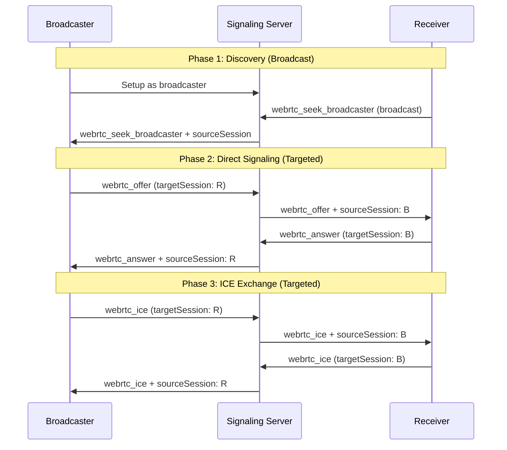

# WebRTC Signaling Architecture for Synopticon API

## Executive Summary

This document outlines the proper WebRTC signaling architecture for the Synopticon API, addressing fundamental issues discovered during the MediaPipe face streaming implementation. The solution leverages existing infrastructure correctly and provides a scalable foundation for real-time peer-to-peer communication.

## Problem Analysis

### What Was Wrong: Technical Debt Issues

During implementation of the MediaPipe WebRTC face streaming demo, several fundamental architecture problems were identified:

#### 1. Broadcasting WebRTC Signaling (Critical Issue)
```javascript
// WRONG: Broadcasting offer/answer to all sessions
sendSignalMessage({
    type: 'notification',
    topic: 'webrtc_broadcast', 
    data: { type: 'webrtc_offer', data: offer, from: sessionId }
});
```

**Problems:**
- WebRTC signaling should be **direct peer-to-peer**, not broadcast
- Created confusion and connection failures
- Generated server errors: `"Unknown message type: notification"`
- Multiple sessions receiving offers meant for specific peers

#### 2. Ignoring Existing Infrastructure
The Synopticon media stream handler (`src/services/api/websocket/media-stream-handler.ts:157-173`) already had excellent targeted messaging:

```typescript
const handleWebRTCSignaling = (sessionId: string, message: any) => {
  if (message.targetSession) {
    // Send directly to specific session - THIS WAS IGNORED
    const targetSession = sessions.get(message.targetSession);
    if (targetSession && targetSession.ws.readyState === 1) {
      targetSession.ws.send(JSON.stringify({
        ...message,
        sourceSession: sessionId  // Automatic source tracking
      }));
    }
  } else {
    // Broadcast to all sessions
    broadcast(message, sessionId);
  }
};
```

**What we missed:**
- Perfect `targetSession` infrastructure for direct messaging
- Automatic `sourceSession` tracking for peer identification
- Clean separation of broadcast vs. targeted messages

#### 3. No Proper Peer Discovery
```javascript
// WRONG: Using inconsistent ID systems
const sender_id = 'stream_DUGYLO3A';        // Random stream ID
const receiver_id = 'ws_1756323620417_...'; // WebSocket session ID
```

**Problems:**
- Mixed ID systems caused connection failures
- No reliable way for peers to find each other
- Manual session ID matching required

#### 4. Fighting Against the System
Instead of using the existing, well-designed infrastructure, the implementation tried to:
- Create custom notification wrappers
- Implement separate broadcasting systems
- Work around the existing message handlers

## Proper WebRTC Signaling Architecture

### Core Principles

1. **Leverage Existing Infrastructure**: Use Synopticon's `targetSession` system
2. **Two-Phase Signaling**: Discovery (broadcast) + Direct signaling (targeted)
3. **Consistent ID System**: Use WebSocket session IDs throughout
4. **Proper Role Separation**: Clear broadcaster vs. receiver roles

### Architecture Overview



### Implementation Details

#### Phase 1: Discovery (Broadcast Messages)
```javascript
// Receiver broadcasts to find broadcasters (no targetSession)
sendSignalMessage({
    type: 'webrtc_seek_broadcaster',
    deviceId: sessionId,
    timestamp: Date.now()
    // No targetSession = broadcast to all
});
```

#### Phase 2: Direct Signaling (Targeted Messages)
```javascript
// Broadcaster responds with targeted offer
sendSignalMessage({
    type: 'webrtc_offer',
    targetSession: peerSessionId,  // Direct to specific peer
    deviceId: sessionId,
    timestamp: Date.now(),
    sdp: offer
});
```

#### Phase 3: ICE Exchange (Targeted Messages)
```javascript
// All ICE candidates are sent directly to peer
sendSignalMessage({
    type: 'webrtc_ice',
    targetSession: peerSessionId,  // Direct to specific peer
    deviceId: sessionId,
    timestamp: Date.now(),
    candidate: iceCandidate
});
```

### Message Flow Examples

#### Successful Connection Flow
```javascript
// 1. Receiver seeks broadcaster (broadcast)
{ type: 'webrtc_seek_broadcaster', deviceId: 'ws_receiver_123' }

// 2. Server adds sourceSession and sends to all
{ type: 'webrtc_seek_broadcaster', sourceSession: 'ws_receiver_123', deviceId: 'ws_receiver_123' }

// 3. Broadcaster creates offer (targeted)
{ type: 'webrtc_offer', targetSession: 'ws_receiver_123', deviceId: 'ws_broadcaster_456', sdp: {...} }

// 4. Server adds sourceSession and sends to receiver
{ type: 'webrtc_offer', sourceSession: 'ws_broadcaster_456', targetSession: 'ws_receiver_123', sdp: {...} }

// 5. Receiver creates answer (targeted)  
{ type: 'webrtc_answer', targetSession: 'ws_broadcaster_456', deviceId: 'ws_receiver_123', sdp: {...} }

// 6. ICE candidates exchanged (all targeted)
{ type: 'webrtc_ice', targetSession: 'ws_broadcaster_456', candidate: {...} }
```

## Implementation Guidelines

### Message Format Standards

All WebRTC signaling messages must follow this format:

```typescript
interface WebRTCMessage {
  type: 'webrtc_seek_broadcaster' | 'webrtc_offer' | 'webrtc_answer' | 'webrtc_ice';
  deviceId: string;           // Sender's WebSocket session ID
  timestamp: number;          // Message timestamp
  targetSession?: string;     // Target session ID (optional for broadcasts)
  sdp?: RTCSessionDescription; // For offer/answer messages
  candidate?: RTCIceCandidate; // For ICE messages
}
```

### Role Management

#### Broadcaster Role
```javascript
const startBroadcasting = async () => {
  state.role = 'broadcaster';
  
  // Wait for discovery messages
  // Respond to webrtc_seek_broadcaster with offers
  // Handle answers and ICE from receivers
};
```

#### Receiver Role  
```javascript
const seekStream = async () => {
  state.role = 'receiver';
  
  // Broadcast discovery message
  sendSignalMessage({ type: 'webrtc_seek_broadcaster' });
  
  // Handle incoming offers
  // Send answers and ICE to broadcasters
};
```

### Error Handling

#### Connection State Monitoring
```javascript
peerConnection.onconnectionstatechange = () => {
  const state = peerConnection.connectionState;
  switch (state) {
    case 'connecting':
      addLog('WebRTC connecting...');
      break;
    case 'connected':
      addLog('WebRTC connected successfully', 'success');
      break;
    case 'failed':
      addLog('WebRTC connection failed', 'error');
      // Implement retry logic
      break;
    case 'disconnected':
      addLog('WebRTC disconnected');
      // Clean up resources
      break;
  }
};
```

#### Signaling Error Recovery
```javascript
const handleSignalMessage = (message) => {
  try {
    // Process message
  } catch (error) {
    addLog(`Signaling error: ${error.message}`, 'error');
    
    // Retry logic for critical messages
    if (message.type === 'webrtc_offer' || message.type === 'webrtc_answer') {
      setTimeout(() => retrySignaling(message), 1000);
    }
  }
};
```

## Infrastructure Integration

### Synopticon WebSocket Handler Integration

The implementation correctly uses existing handlers in `src/services/api/websocket/message-handlers.js`:

```javascript
// Lines 239-245: WebRTC message routing
case 'webrtc_offer':
case 'webrtc_answer':
case 'webrtc_ice':
case 'request_offer':
  mediaStreamHandler.handleMessage(session.id, data);
  break;
```

And `src/services/api/websocket/media-stream-handler.ts`:

```javascript
// Lines 66-74: Message type routing
case 'webrtc_offer':
case 'webrtc_answer':
case 'webrtc_ice':
case 'request_offer':
  handleWebRTCSignaling(sessionId, message);
  break;
```

### Server Configuration Requirements

No server changes required - the existing infrastructure handles:
- ✅ WebSocket session management
- ✅ Targeted message routing via `targetSession`
- ✅ Automatic `sourceSession` injection
- ✅ Broadcasting for discovery messages
- ✅ Session cleanup and timeout handling

## Performance Considerations

### Scalability
- **O(1) signaling complexity** per connection (no broadcasting overhead)
- **Direct peer-to-peer** reduces server load
- **Session-based routing** scales linearly with concurrent users

### Optimization Opportunities
1. **ICE Candidate Batching**: Group ICE candidates to reduce message count
2. **Connection Pooling**: Reuse connections for multiple streams
3. **STUN/TURN Server Integration**: Add enterprise-grade NAT traversal

## Testing Strategy

### Unit Testing
```javascript
describe('WebRTC Signaling', () => {
  it('should route discovery messages to all sessions', () => {
    // Test broadcast behavior
  });
  
  it('should route offers directly to target session', () => {
    // Test targeted messaging
  });
  
  it('should handle connection failures gracefully', () => {
    // Test error recovery
  });
});
```

### Integration Testing
1. **Multi-tab browser testing**: Open demo in multiple tabs
2. **Network condition simulation**: Test under poor connectivity  
3. **Session timeout testing**: Verify cleanup behavior
4. **Cross-browser compatibility**: Safari, Chrome, Firefox testing

## Security Considerations

### Authentication
- All WebRTC signaling goes through authenticated WebSocket sessions
- Session IDs provide natural access control
- No direct peer-to-peer signaling bypasses server security

### Data Protection
- WebRTC data channels use DTLS encryption by default
- Signaling messages contain no sensitive data
- Face landmark data is ephemeral (not stored)

### Access Control
```javascript
// Future: Role-based access control
const canInitiateConnection = (sessionId, targetSessionId) => {
  // Check permissions, rate limits, etc.
  return authService.canConnect(sessionId, targetSessionId);
};
```

## Future Enhancements

### Multi-party Connections
The architecture supports extension to multi-party scenarios:

```javascript
// Broadcasting to multiple receivers
const broadcastOffer = (offer) => {
  connectedReceivers.forEach(receiverId => {
    sendSignalMessage({
      type: 'webrtc_offer',
      targetSession: receiverId,
      sdp: offer
    });
  });
};
```

### Advanced Features
1. **Screen Sharing**: Additional video tracks through existing connections
2. **File Transfer**: Dedicated data channels for file sharing
3. **Selective Forwarding Unit (SFU)**: Server-side media routing for efficiency
4. **Recording Integration**: Server-side media capture and storage

## Migration Path

### From Old Implementation
1. **Replace broadcast signaling** with targeted messages
2. **Use consistent session IDs** throughout
3. **Implement proper discovery phase** with `webrtc_seek_broadcaster`
4. **Add comprehensive logging** for debugging

### Testing Checklist
- [ ] Discovery messages broadcast correctly
- [ ] Offers sent to specific target sessions  
- [ ] Answers routed back to broadcasters
- [ ] ICE candidates exchanged properly
- [ ] Connection state changes handled
- [ ] Error recovery works
- [ ] Session cleanup on disconnect
- [ ] No server-side errors in logs

## Implementation Reference

The complete reference implementation is available at:
- **Demo**: `/examples/streaming/webrtc-signaling-demo.html`
- **Server**: Existing handlers in `src/services/api/websocket/`

This implementation serves as the foundation for all future WebRTC features in the Synopticon API.

## Conclusion

The proper WebRTC signaling architecture leverages Synopticon's existing infrastructure correctly, providing:

- **Reliable peer-to-peer connections** through targeted signaling
- **Scalable discovery mechanism** via broadcast + direct messaging pattern  
- **Clean separation of concerns** between discovery and connection phases
- **Comprehensive error handling** and logging
- **Foundation for future features** like multi-party calls and media routing

This architecture eliminates the technical debt from the previous implementation and provides a rock-solid foundation for real-time communication features.